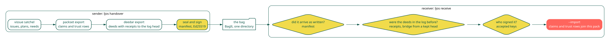

A product, frozen
=================

Work produces things: a patch, a table, a quote from a source, a page as it
looked. The next unit of work needs to open the thing, not reread the
conversation that made it. A deed is that thing, frozen: the bytes by
hash, the producer, the inputs it was made from, and a kind that says what
shape it is. Because the bytes are content addressed, a deed cannot drift.
Because a better take is a new deed with ``--supersedes``, a citation of the
old one still resolves and ``current`` says where it went.

Why a log
=========

|image1|

Every deed carries a keyed hash under the store's writer key, and a
signature when the host has a signing key. Either says a deed is the one
the store wrote. It does not say what else the store contains. A holder can
hand one reader the store and another the same store with a deed removed,
and both sets verify. ``delete`` is a supported verb, so this is not a
hypothetical.

The log binds the set. Each deed appends a leaf, the leaves hash into a
Merkle tree, and the store signs the root and the size as a head. Two
proofs follow that a pile of signatures cannot give. An inclusion proof
shows a deed is in the tree a head names, so a store that dropped it cannot
produce a head that still covers it. A consistency proof shows a later head
extends an earlier one rather than replacing it, so a store cannot rewrite
what it published without every reader who kept a head noticing. The
construction is Certificate Transparency's (doi:10.17487/RFC9162), and it
fits here because the party being audited is the party serving the data.

What the log does not do is gossip. One store signing its own heads catches
a holder who rewrites history between two readings by the same reader, and
catches deletion. It does not catch a holder who keeps two consistent logs
and shows one to each reader. That needs heads compared somewhere neither
controls, which is a network protocol rather than a file format.

The family this log belongs to
==============================

The hash is Certificate Transparency's, named above
(doi:10.17487/RFC9162). The shape it descends from is the history tree
of Crosby and Wallach, USENIX Security 2009. The live systems split by
the job. Rekor (`sigstore.dev <https://www.sigstore.dev>`__) is a hosted
log whose monitors compare heads, which is the gossip this file does
not do. The Update Framework (`theupdateframework.io
<https://theupdateframework.io>`__) rotates update authority through
delegations. A receiver here lists accepted keys in ``layout``, and
replacing that list is the rotation. Supply-chain Levels for Software
Artifacts (`slsa.dev/provenance <https://slsa.dev/provenance>`__)
attests a build. A deed's kind says the shape. Its sources name the
inputs, and ``trail`` walks the sources that are deeds. The host
sidecar signs the deed. This store does not grow
a public log or a quorum.

Integrity, authenticity, authorisation
======================================

Three questions, three constructions. A hash answers integrity: these are
the bytes. A signature over the manifest answers authenticity: this key
made the bag, and a receiver checks it against the keys they accept. A
signed host sidecar answers who held the host key when the deed was made.
The sidecar is a signature and never a keyed hash: a keyed-hash (HMAC)
verifier has the key and can mint what it checks, and with the key beside
the store that includes the agent being vouched for. A public key cannot
mint.

Holding the key is authorisation only when the agent cannot read the key.
The default key is ``~/.config/deedar/host.key``, one per user account, so it
names an account on one machine. Every seat and agent that runs as that
user reads the same file and signs as the same host, and a signature does
not tell them apart. ``producedBy`` is what the caller passed to ``--agent``. To
make the signature mean one agent was entitled, keep the key under another
Unix user or behind a signer the agent cannot drive, and keep the store's
``layout`` out of the agent's reach, since the layout lists the keys that count.

Two writers, one log
====================

Bytes and deeds are content addressed, so two processes minting the same
product write the same files. The log is the one place order matters: an
append takes a file lock for the one write, so entries from two processes
are whole lines in some order, never interleaved bytes.

One identifier
==============

The accession is the only thing that crosses the stack. A tracker cites it
on a node; a pack cites it in a claim; this store answers ``get``, ``trail``,
``evidence`` and ``current`` for it. None of the three opens another's format.
The seat composes them by passing accessions on pipes, and a handover
carries the deeds beside the tracker slice and the claims that cite them.

